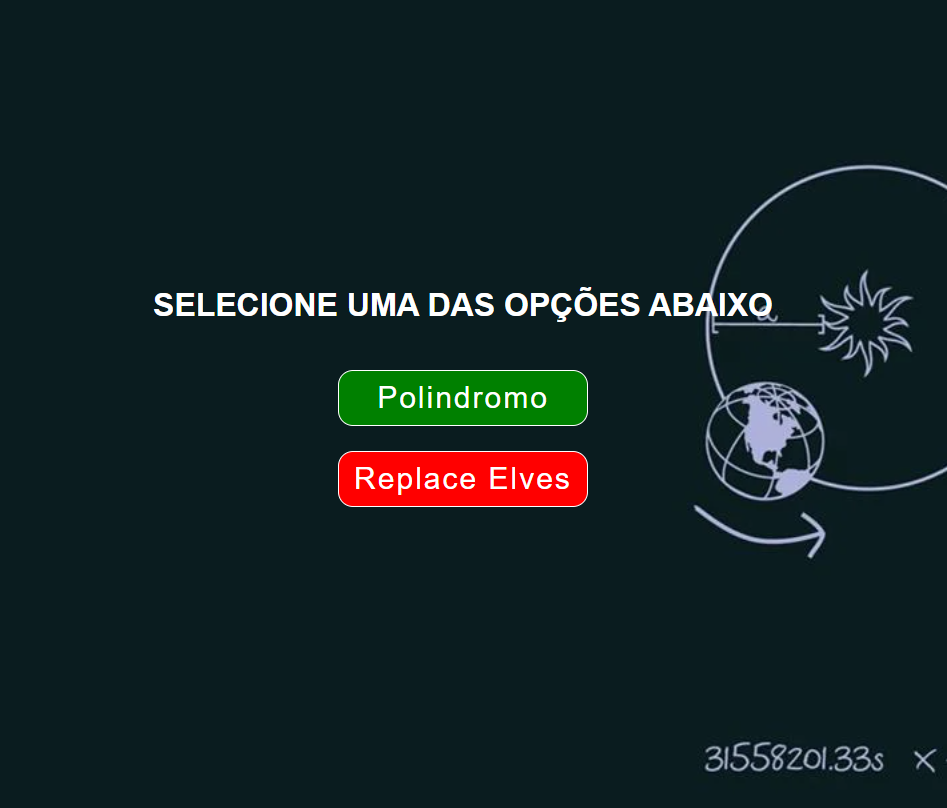

# Modelo com replace e verificação com utilização de módulos

- Utilização do módulo map, replace, reverse, split, join e includes;
- Utilização de reverse em array;
- Conversão de elementos de uma array para numbers;
- addEventListener;
- Utilização de estilização e transitions.

